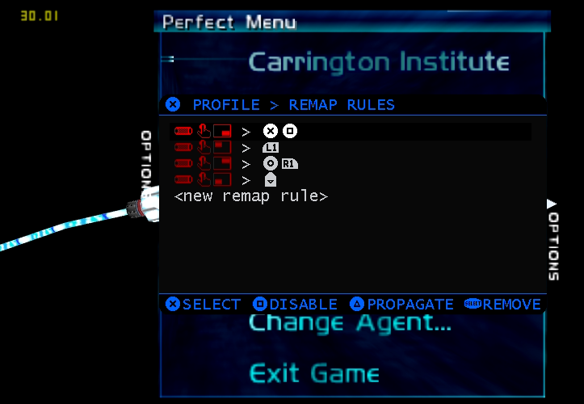

When I first installed the original PS Vita version of this port, I found the controls to be somewhat iffy. There were around two inputs mapped for each action, mostly drawing from PC keyboard controls and I found it quite unlikely to envisage Vita gamers as using mouse and keyboard input! So I decided to rework the controls to a more intuitive set along the lines of modern first person shooters. I also recalled the utility and joy of pressing B + Z for quick secondary fire on original N64 hardware, something I've always mapped to a discrete button in emulation, so wanted to bring that in here too. However, I chose to leverage the [reVita plugin](https://github.com/MERLev/reVita) to incorporate this and several other macros, in combination with the Hori Playstation Vita 2000 Grip accessory to open up handy L2/R2/L3/R3 buttons via the rear touchpad. The macros are shown in this image:

and correspond to:

L2: L1 (aim crosshairs)

L3: D-pad Down (cycle crouch)

R2: Circle + R1 (secondary fire quick trigger activate)

R3: Cross + Square (reload, or also remote mine "A+B" instant detonate!)

For the secondary fire quick trigger, I recommend not using it for all weapons. Some make a lot of sense for it to so as to use rapid on-the-fly alternative attacks e.g. certain handguns: Pistol Whip, SuperDragon: Grenade Launcher and Phoenix: Explosive Shells. However, this won't follow along for other weapons like the CMP-150 which requires one of its modes to be active at a time. I leave it to the players to figure out which weapons are best suited for it.

Besides the aforementioned grip button inputs, the controls are as follows:

D-pad Up: Radial weapon wheel

D-pad Left: Previous weapon

D-pad Right: Next weapon

D-pad Down: Cycle crouch

Left stick: Directional movement

Right stick: Look around

Front touchscreen: Mouselook

Square: Reload/cancel in menus

Cross: Open doors/grab hovercrate or hoverbike/interact with terminals/choose option in menus/double tap to mount or dismount hoverbike

Circle: Toggle primary/secondary weapon mode

Triangle: Currently unused (perhaps radial weapon wheel in the future as it corresponds to D-pad Up in placement on the controller)

L1: Aim crosshairs

R1: Fire weapon (or punch, knife slash etc)

Start: Pause menu

Select: Cycle crouch

Over time, I am open to adding more configurations such as DS4 (especially important for PSTV hardware) and basic PS Vita button-only input (stripped down from this current configuration). If anyone can assist with contributing alternative grip accessory configurations, that would be much appreciated.
